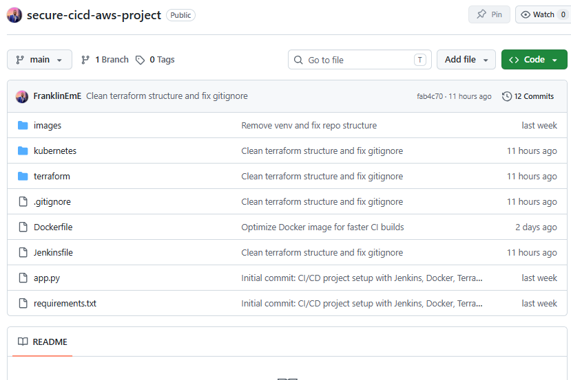
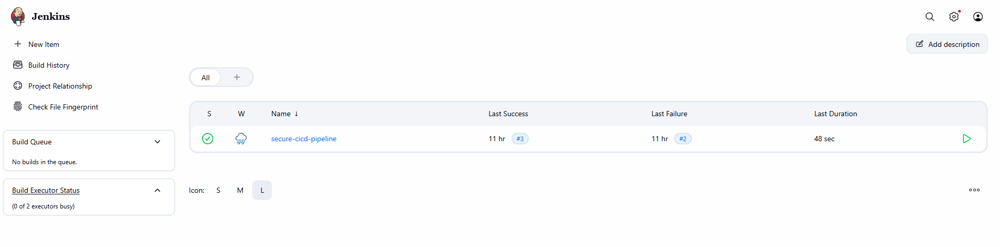
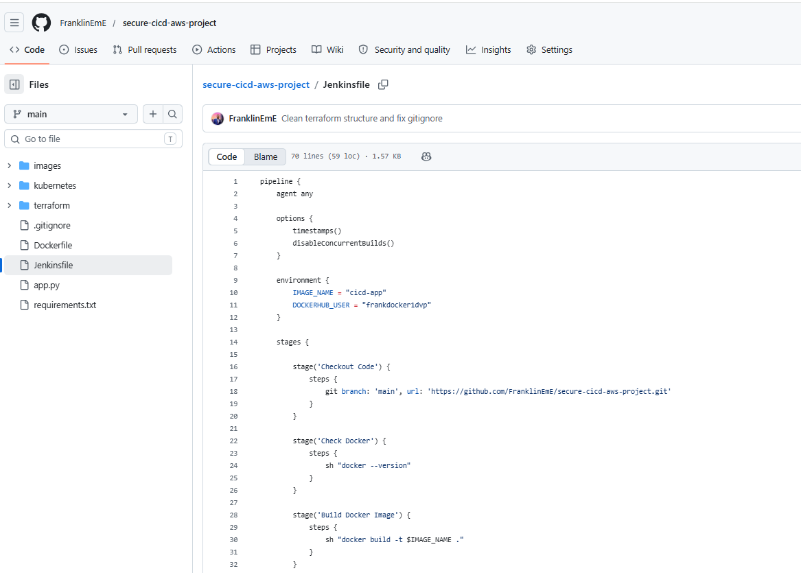
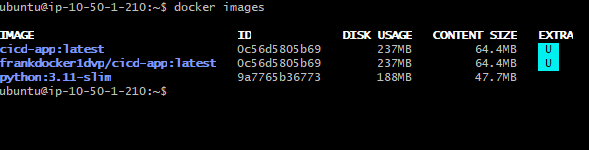
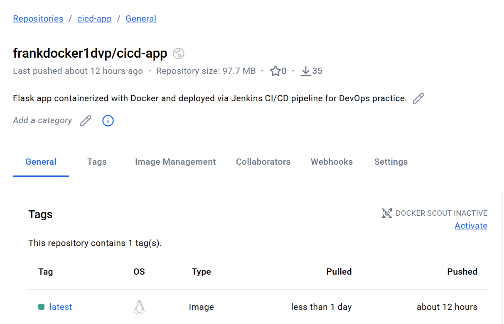
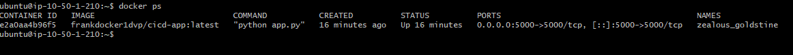
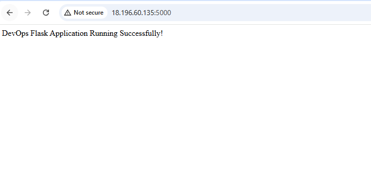
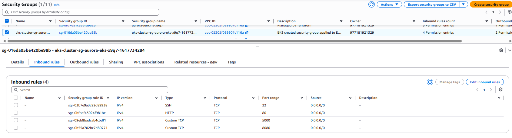
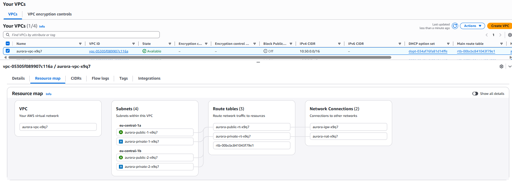

# 🚀 Secure CI/CD AWS DevOps Project  
### (Jenkins + Docker + Terraform + Kubernetes)

---

# 📌 Project Overview

This project demonstrates a complete end-to-end CI/CD pipeline for a Flask application using modern DevOps tools.

It automates:

- Code push from GitHub  
- Jenkins pipeline execution  
- Docker image build  
- Push to DockerHub  
- Deployment on AWS EC2  
- Optional Kubernetes deployment  

This project simulates a real production DevOps workflow.

---

# ⚙️ Architecture Flow

GitHub → Jenkins → Docker Build → DockerHub → AWS EC2 → Running Container → Browser

---

# 🧰 Tech Stack

- AWS EC2  
- Jenkins  
- Docker  
- DockerHub  
- Terraform  
- Kubernetes  
- GitHub  
- Flask (Python)

---

# 🌐 Live Application

👉 http://63.184.220.105:5000

---

# 🚀 CI/CD Pipeline Steps

- Developer pushes code to GitHub  
- Jenkins automatically triggers pipeline  
- Docker image is built  
- Image is pushed to DockerHub  
- EC2 pulls and runs container  
- Application becomes live  

---

# 📸 PROJECT SCREENSHOTS

---

## 🔹 1. GitHub Repository

**Description:** Source code stored in GitHub. This is where CI/CD starts.

---

## 🔹 2. Jenkins Dashboard

**Description:** Jenkins pipeline job and build history.

---

## 🔹 3. Jenkins Pipeline Execution

**Description:** Successful execution of all pipeline stages.

---

## 🔹 4. Docker Image Build

**Description:** Docker image built inside Jenkins.

---

## 🔹 5. DockerHub Repository

**Description:** Image pushed to DockerHub registry.

---

## 🔹 6. Running Container on EC2

**Description:** Container running on AWS EC2 exposing port 5000.

---

## 🔹 7. Live Application

**Description:** Flask app successfully running in browser.

---

## 🔹 8. Security Group Configuration

**Description:** AWS security group allowing inbound traffic on port 5000.

---

## 🔹 9. AWS VPC Architecture

**Description:** AWS VPC, subnet, routing, and EC2 layout.

---

# 📂 Project Structure
secure-cicd-aws-project/
│
├── app.py
├── Dockerfile
├── Jenkinsfile
├── requirements.txt
│
├── terraform/
│ ├── main.tf
│ ├── eks.tf
│ ├── security.tf
│ ├── variables.tf
│
├── kubernetes/
│ ├── deployment.yaml
│ ├── service.yaml
│
└── screenshots/

---

# 🔐 Key Features

- Fully automated CI/CD pipeline  
- Docker containerization  
- AWS EC2 deployment  
- Terraform infrastructure provisioning  
- Kubernetes deployment support  
- DockerHub integration  

---

# 📊 What I Learned

- Jenkins automation  
- Docker workflow  
- AWS EC2 deployment  
- Kubernetes basics  
- Terraform IaC  
- CI/CD best practices  

---

# 🚀 Future Improvements

- Kubernetes EKS cluster deployment  
- Monitoring with Prometheus & Grafana  
- HTTPS with Nginx  
- Multi-environment CI/CD (dev/staging/prod)  

---

# 👨‍💻 Author

Franklin Chidera Emmanuel  
GitHub: https://github.com/FranklinEmE  

---

# ⭐ Final Note

This project demonstrates a real-world DevOps pipeline from code commit to production deployment using industry-standard tools.
